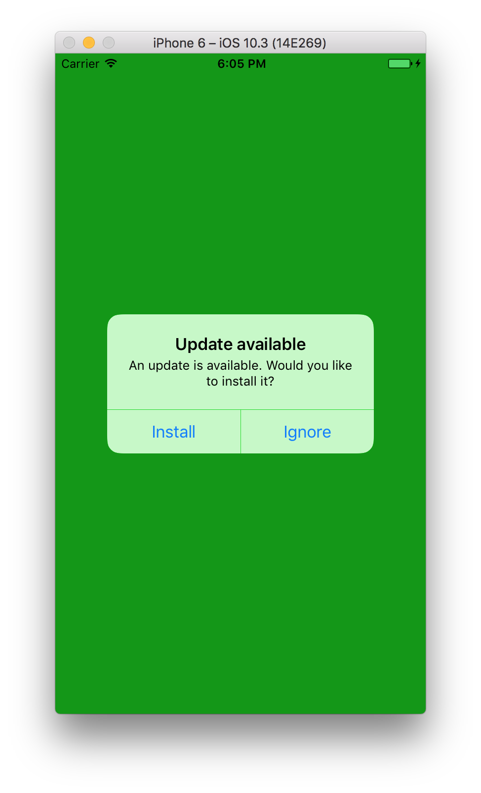

# Code Push

When you develop a mobile application with React Native, you will need to share it to your users by the store (AppStore or PlayStore).

Then, when your app is available, you will obviously encounter a production bug. In this kind of situation, depends of the bug gravity, it could be better to do a rollback to the previous version of your application. However, actually, the AppStore and PlayStore don't let us to do this kind of things.

Indeed, you will have to upload the previous build version of your app to do a rollback. And also wait for the update to be effective. As you know, this could take some hours for the PlayStore to some days for the AppStore.

You risk, in case of blocking bug, to frustrate all the next users of your app and generate bad notes and comments until the correct patch.

Hopfully, there is a solution to this problem who will let you to update your application **without passing by the store** who is  [CodePush](https://microsoft.github.io/code-push/).

## CodePush, a service

CodePush is a hosted service highlighted by Microsoft who offer to React Native & Cordova developers, the ability to deploy updates directly on their user's phones.

It works simply by a repo system, in which you will send your JavaScript build to the service who will make the link with the application who use the SDK.

**Note :** CodePush only allow to update statics elements like HTML, CSS, JavaScript and pictures. If you edit a native module, you will have to send your app to the store.

## Configure our application

Before setting up the SDK, we have to create a new application in CodePush. This will be done by the CLI tool in 3 steps :

1 - install CodePush CLI
```
npm i -g code-push-cli
```

2- register to CodePush (if you don't own one yet)
```
code-push register
```

3- Create an application
```
// At the root of your app
code-push app add MyApp-android android react-native
code-push app add MyApp-ios ios react-native
```

You will see that we have to create an app for each platform. This has the disavantage to make you deploy 2 times the same build but this will allow you to fix a bug on a specific platform.

At the end, you will have two pairs of deploy keys (Staging, Production).
We will need it later but you can retrieve them with this command :

```
code-push deployment list MyApp-android -k
```

## Setup the SDK

The SDK write by Microsoft is very well maintened on [Github](https://github.com/Microsoft/react-native-code-push) and follow scrupulously each React Native update. You can retrieve the list of CodePush versions based on [React Native version](https://github.com/Microsoft/react-native-code-push#supported-react-native-platforms).

To begin, you need to install the module :
```
yarn add react-native-code-push
```

This SDK use native modules, so you must link him to the application :
```
react-native link react-native-code-push
```

I will ask you to give the production keys for Android and iOS. And then, you will be able to use the SDK in your application.

To use the SDK, it's very easy, you just need to use a "Higher Order Component" (HOC) on the root component of your application (`App.js` in the demo project).

```javascript
import React from 'react'
import codePush from 'react-native-code-push'

class App extends React.Component {
  ...
}

export default codePush(App)
```

Your app can now be updated by CodePush ! When you don't specify options, by default, CodePush will check if there is an update at the starting of the application, and if finds one, download it in background to install them at the next restart of the app.

#### Edit the check frequency

Of course, you can edit the frequency at which it checks if there is an update and when to install it.
For it, you need to pass an object as a params like this :

```javascript
import codePush, { CheckFrequency } from 'react-native-code-push'
...
export default codePush({
  checkFrequency: CheckFrequency.ON_APP_RESUME
})(App)
```

The SDK offer us 3 ways to check update presence :
- `ON_APP_START` : only when the app processus start
- `ON_APP_RESUME` : when the application will go outside background mode
- `MANUAL` : disallow the automatic checking and wait the call of `codePush.sync()` method.

#### Edit install mode

By default, CodePush will install the new bundle only at the application restart. It's possible for you to install the update immediatly after the download.
```javascript
import codePush, { CheckFrequency, InstallMode } from 'react-native-code-push'
...
export default codePush({
  mandatoryInstallMode: InstallMode.IMMEDIATE
})(App)
```

The SDK offer us 3 ways to install the update :
- `IMMEDIATE` : update and restart the app
- `ON_NEXT_RESTART` : default behavior, install the update after app restart
- `ON_NEXT_RESUME` : install the update when the app will go outside background mode

Now our SDK is well configured in our application, we can right create our first release with the CodePush CLI tool :
```
code-push release-react MyApp-android android
code-push release-react MyApp-ios ios
```

To that, it's possible to add very interesting options :
- a description
- the version from which the update can be installed
- the environment, who is by default on `Staging`

```
code-push release-react MyApp-ios ios -d Production --targetBinaryVersion '~1.0.0' -m --description "Fix background"
```

And voila ! Our first release is done !

## Rollback

Let us resume our case of the beginning, where we inconveniently released a bugged version of our app with CodePush. It's very fair to do a rollback on the previous version with the CLI : 
```
code-push rollback MyApp-ios Production
```

By default, CodePush will take the previous version of the most recent, in the case you need to back further in your app history, you simply need to put the parameter `--targetRelease` with the label's name release (v2, v3, etc...).

```
code-push rollback MyApp-ios Production --targetRelease v3
```

## Update manually

In some cases, you may need to offer to the user, the ability to check himself if there is an update.
To do that with CodePush, you have to give the parameter `updateDialog` to `true` or an object configuration. Here is an example : 

```javascript
import codePush, { CheckFrequency, InstallMode } from "react-native-code-push";

class App extends Component {
  render() {
    return (
      <View style={styles.container}>
        <TouchableOpacity onPress={this._checkUpdates}>
          <Text>Check for updates</Text>
        </TouchableOpacity>
      </View>
    );
  }

  _checkUpdates() {
    codePush.sync({
      updateDialog: true,
      installMode: InstallMode.IMMEDIATE
    });
  }
}

export default codePush({
  checkFrequency: CheckFrequency.MANUAL
})(App);
```

When the update will be available and the user will press the button, he will get a native modal suggesting him to install the update.



Obviously, you can edit each text [via the params object](https://github.com/Microsoft/react-native-code-push/blob/master/docs/api-js.md#codepushoptions) `updateDialog`.

**Note :** It's very important to know that this is **not allowed by the Apple guidelines** and they will not validate your app ! Howerver, you can do it on Android.

## Conclusion

CodePush has only advantages and is very easy to setup/configure. I can only recommand you to use it. You can retrive the different examples of this article on the [Github demo repo](https://github.com/DCKT/codepush-demo).