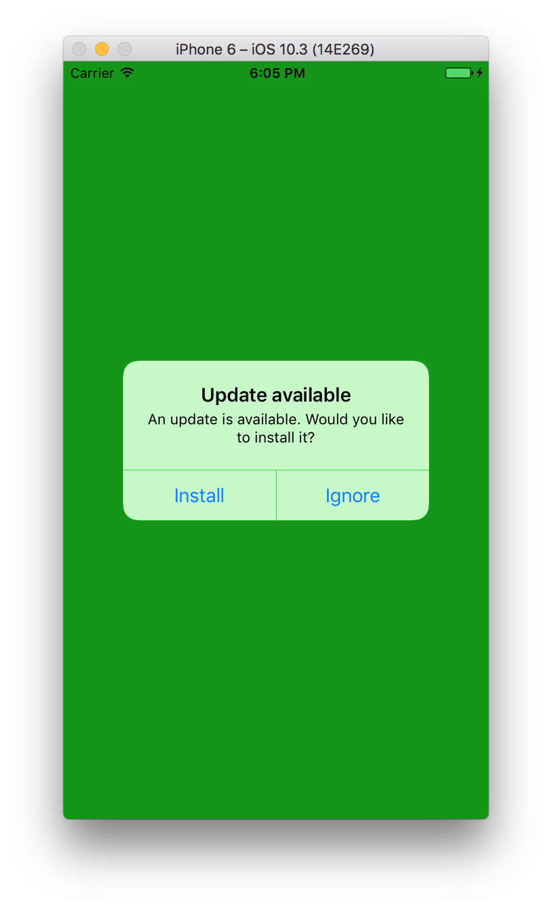

# Code Push

Lorsque vous développez une application mobile avec React Native, vous allez devoir passer par le store (AppStore ou PlayStore) un moment ou un autre pour partager votre application avec vos utilisateurs.

Une fois votre application à la portée de vos utilisateurs, vous allez forcément rencontrer tôt ou tard un bug de prod. Dans ce genre de moment, selon la gravité du bug, il peut être préférable d'éffectuer un rollback à la dernière version de votre application. Cependant, les différents stores ne fournissent pas les éléments dédiés à cela à l'heure actuelle.

En effet, que ce soit sur l'AppStore ou le PlayStore, vous serez obligé d'uploader le build de la version précédente pour effectuer ce "rollback". Et ainsi d'attendre que cette mise à jour soit effective. Cela peut prendre plusieurs heures pour le PlayStore à plusieurs jours pour l'AppStore).

Vous risquez donc, en cas de bug bloquant, de frustrer tous les prochains utilisateurs jusqu'à la prochaine version et générer ainsi des avis négatifs et mauvaises notes pour votre application.

Heureusement, il existe une solution à ce problème qui va vous permttre de mettre à jour votre application **sans passer par le store** qui est [CodePush](https://microsoft.github.io/code-push/).

## CodePush, un service

CodePush est un cloud service mis en avant par Microsoft qui offre aux développeurs React Native et Cordova, un moyen pour déployer des mises à jours directement sur le téléphone de leurs utilisateurs.

Cela fonctionne simplement par un système de repo, vous allez envoyer votre build JavaScript au service qui va faire la liaison avec l'application qui utilise le SDK fourni.

**Note:** CodePush permet de mettre à jour uniquement les éléments statiques à savoir le HTML, CSS, JavaScript et les images. Si vous modifiez un élément d'un module natif, vous serez dans l'obligation de passer par le store.

## Configurer notre application

Avant de mettre en place le SDK, nous devons configurer notre application de sorte à l'ajouter dans un repo CodePush. Tout cela se fait par ligne de commande en 3 étapes :

1 - installer le CLI CodePush 
```
npm i -g code-push-cli
```

2- créer un compte CodePush (si vous n'en possédez pas)
```
code-push register
```

3- Ajouter votre application
```
// À la racine de votre application
code-push app add MyApp-android android react-native
code-push app add MyApp-ios ios react-native
```

Vous pourrez constater que l'on doit créer une application par plateforme. Cela aura le défaut de vous faire déployer 2 fois le même build mais vous permettra de corriger un problème sur une plateforme spécifique.

À la fin, vous disposerez de deux paires de clés de déploiement (Staging/Prod).
Nous en aurons besoin par la suite mais vous pouvez les retrouver grâce à cette commande : 
```
code-push deployment list MyApp-android -k
```

## Mettre en place le SDK

Le SDK développé par Microsoft est très bien maintenu sur [Github](https://github.com/Microsoft/react-native-code-push) et suit scrupuleusement chaque mise à jour React Native. Vous pourrez retrouver une liste des versions de CodePush en rapport avec [la version de React Native supporté](https://github.com/Microsoft/react-native-code-push#supported-react-native-platforms)

Pour commencer, il vous faut installer le module :
```
yarn add react-native-code-push
```

Ce SDK utilise des modules natifs, il doit donc être lié à votre application : 
```
react-native link react-native-code-push
```

Il vous sera alors demandé de renseigner les clés de production pour le déploiement Android et iOS.
Nous pouvons dès à présent utiliser le SDK dans notre application.

Pour utiliser le SDK, c'est très simple, il suffit d'utiliser un "Higher Order Component" (HOC) sur la base de notre application ici `App.js`.

```javascript
import React from 'react'
import codePush from 'react-native-code-push'

class App extends React.Component {
  ...
}

export default codePush(App)
```

Votre application peut désormais être mis à jour via CodePush ! Lorsque vous ne spécifiez aucune option, par défaut CodePush va vérifier s'il y a une mise à jour au démarrage de l'application et s'il en trouve une, la télécharger en tache de fond pour l'installer la prochaine fois que l'utilisateur va redémarrer l'app.

#### Modifier la fréquence de vérification

Bien évidemment, il est possible de modifier la fréquence à laquelle on vérifie s'il y a une mise à jour et le moment durant laquelle il faut l'installer.
Pour cela, il vous suffit de passer un object au SDK comme ceci :
```javascript
import codePush, { CheckFrequency } from 'react-native-code-push'
...
export default codePush({
  checkFrequency: CheckFrequency.ON_APP_RESUME
})(App)
```

Le SDK nous offre 3 façons de vérifier la présence d'une mise à jour :
- `ON_APP_START` : uniquement au démarrage du processus de l'application
- `ON_APP_RESUME` : lorsque l'application sort du mode tâche de fond
- `MANUAL` : désactive la vérification automatique et attends l'appel de la méthode `codePush.sync()`

#### Modifier le type d'installation

Par défaut, CodePush va installer le nouveau bundle seulement lorsque l'application sera redémarée. Il vous est possible d'installer la mise à jour de manière immédiate lorsque celle-ci est téléchargée.
```javascript
import codePush, { CheckFrequency, InstallMode } from 'react-native-code-push'
...
export default codePush({
  mandatoryInstallMode: InstallMode.IMMEDIATE
})(App)
```

Le SDK nous offre 3 façons de vérifier la présence d'une mise à jour :
- `IMMEDIATE` : met à jour et redémarre instantanément l'application
- `ON_NEXT_RESTART` : comportement par défaut, installe la MAJ au prochain redémarrage
- `ON_NEXT_RESUME` : installe la mise à jour lorsque l'application sort du mode tâche de fond

## Déployer son application

Maintenant que le SDK est configuré dans notre application, nous pouvons dès à présent créer notre première "release". Pour cela, nous devons utiliser l'outil de CLI de CodePush :
```
code-push release-react MyApp-android android
code-push release-react MyApp-ios ios
```

À cela, il est possible d'ajouter plusieurs options très intéressantes : 
- Une description
- La version à partir de laquelle la mise à jour peut être installée
- L'environnement, qui est par défaut sur `Staging`

```
code-push release-react MyApp-ios ios -d Production --targetBinaryVersion '~1.0.0' -m --description "Fix background"
```

Voilà votre première release effectuée !

## Effectuer un rollback

Reprenons notre cas du début, ou l'on déploit malencontreusement une version de notre app avec un bug via CodePush. Il est très simple d'effectuer un rollback sur la dernière version, tout cela en CLI :
```
code-push rollback MyApp-ios Production
```

Par défaut, CodePush va prendre la version précédente à la plus récente, dans le cas ou vous souhaitez faire un retour arrière sur plusieurs versions, il vous suffit de spécifiez le paramètre `--targetRelease` qui va se baser sur les labels de chaque release (v2, v3, etc..) : 
```
code-push rollback MyApp-ios Production --targetRelease v3
```

## Mettre à jour manuellement

Il arrive que dans certains cas, vous souhaitiez permettre à l'utilisateur de mettre à jour l'application à travers un bouton affichant une fenêtre d'action.
Il suffit de passer le paramètre `updateDialog` à `true` ou bien de lui passer un objet de configuration. Voici un petit exemple : 

```javascript
import codePush, { CheckFrequency, InstallMode } from "react-native-code-push";

class App extends Component {
  render() {
    return (
      <View style={styles.container}>
        <TouchableOpacity onPress={this._checkUpdates}>
          <Text>Check for updates</Text>
        </TouchableOpacity>
      </View>
    );
  }

  _checkUpdates() {
    codePush.sync({
      updateDialog: true,
      installMode: InstallMode.IMMEDIATE
    });
  }
}

export default codePush({
  checkFrequency: CheckFrequency.MANUAL
})(App);
```

Lorsqu'une mise à jour sera disponible et que l'utilisateur appuiera sur le bouton, il aura une fenêtre (native) lui proposant d'installer la mise à jour :



**Note :** Il est important de savoir que cela n'est **pas autorisé par les règles d'Apple** et ne valideront pas votre application ! Cependant c'est tout à fait autorisé sur Android.